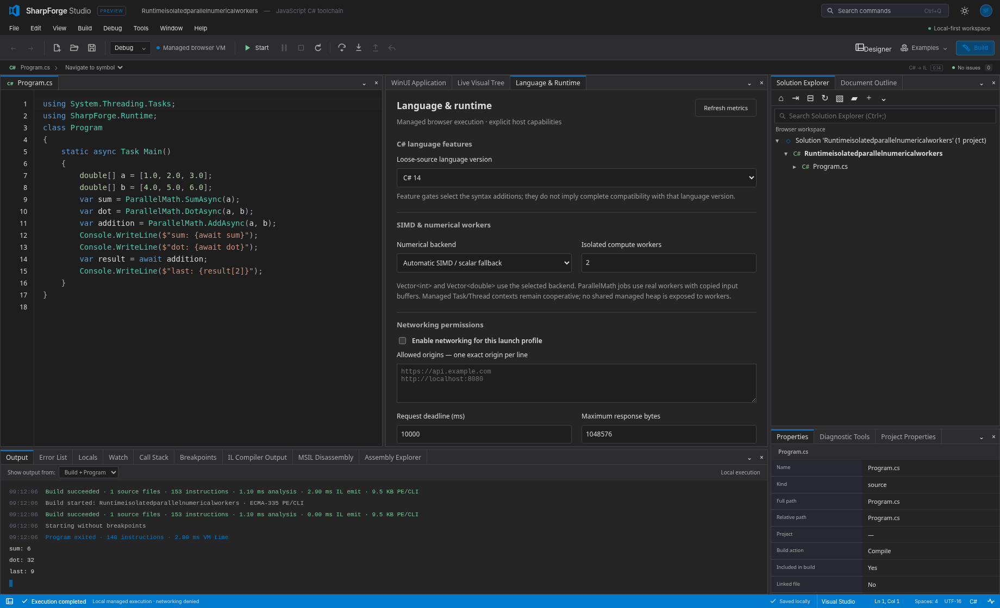

# SharpForge Studio

### JavaScript C# compiler, real managed IL, two execution engines, and a browser IDE.

**0.14.0 development preview.** Selected C# 14 and C# 15 preview features, common JSON/Array/Random/HTTP APIs, real WebAssembly SIMD and isolated compute workers, and measurable VM collection-path optimizations. **44 docking tools, 25 packages, 52 toolbox entries and 68 Studio examples.** This remains a documented managed/browser profile, not complete C#/CLR/Windows App SDK/Visual Studio equivalence.



[0.14 release notes](docs/release-0.14.0.md) · [Validation](docs/validation-0.14.0.md) · [Language / Runtime / Networking guide](docs/language-runtime-networking.md) · [Performance measurements](docs/performance-0.14.0.md) · [New disk/ZIP examples](examples/release14/README.md) · [Supported API inventory](docs/runtime14-api.md) · [Native MSBuild](docs/msbuild.md)

## New in 0.14

Open **Window → Language & Runtime** to choose a language profile, numerical backend, worker count and explicitly granted network origins. Networking is denied by default and its grants are never restored from source/ZIP/recovery. Source code uses real HttpClient requests; the local HTTP example requires a separately started server. Server CSP permission and session capability are independent controls.

The compiler adds field-backed properties, target-typed new, collection expressions/spreads, null-conditional assignment, and explicitly gated preview capacity arguments/labeled jumps. Common BCL additions include System.Text.Json, Array helpers and seeded Random. Real SIMD128 kernels and independent numerical workers back supported Vector and ParallelMath contracts; C# Task/Thread contexts remain cooperative, not arbitrary managed OS threads. The VM rejects reverse restoration across external operations instead of repeating requests.

Cached ABI/property lookup, incremental dictionary indexes and ring-buffer queues improve measured workloads. Worker startup/data copying and scalar fallbacks are reported, not hidden. The source/runtime/IL round-trip, HTTP, WebSocket, compute, browser and installed-package tests exercise actual implementations. See the guide for scope, security and limits. Existing bidirectional designer editing, styles, animation, Hot Reload and editor modes are retained.

## New in 0.13

Choose **Examples → Designer · C# two-way editing**, open **Designer**, then **Connect C# → Program.cs**. Literal property edits compile-check minimal source changes; structural edits only regenerate a proven construction region. Existing handlers stay yours. C# edits and undo/redo refresh the preview; dynamic expressions are protected rather than executed. Conflicting edits stop for reconciliation.

The same source editor participates in Design/Split/C#/Preview views. The property grid has categories, contextual placement, mixed-value and color indicators; toolbox groups, device presets, breadcrumbs, rulers and light/dark chrome improve navigation.

Closed primitive List/Dictionary/HashSet/Queue/Stack contracts, collection initializers, versioned foreach, StringBuilder, string/Math helpers and interpolation run through both engines and rebuilt IL. Storyboards add bounded DoubleAnimation playback, easing, transforms, managed completion and correct animated/base/style restoration. Three CSS-backed wrapping panels provide layout and spans. See the guide for exact supported types, culture/layout deviations and ownership constraints.

## New in 0.12

Choose **Designer** to open the toolbox, visual tree, design surface, property grid, layout, resource and source editors. Pixel dragging/resizing, snapped geometry, Grid tracks/cells/boundaries, flow layout, shared styles, template parts, per-owner property bindings and undo use the same saved design document. Generate real C# plus a project/solution, or **Attach running app → Apply to live** to preserve typed text, object identities and handlers.

**Hot Reload → Edit code → Apply** supports compatible source method/type additions, appended fields and active-local mapping with preflight and rollback. Native CLR updates and structural ordinary-DLL updates are not claimed. The [compatibility table](docs/edit-continue-designer.md#edit-and-continue--hot-reload) distinguishes source VM and direct CIL behavior.

New code-first controls include NumberBox, RadioButton, tabs, date/time input, InfoBar and explicit-dialog controls. The shared registry contains 101 named types and 795 members, including helper/value/task types. Per-instance templates, local/template/style/default precedence and shared-setter rollback work through the managed and independent JavaScript facades. Five [folder/ZIP examples](examples/designer) and matching Studio entries exercise the update.

## New in 0.11

Use **Ctrl+Shift+N** for console, async console, library, empty project, WinUI application/control library, self-test console and single-/multi-project SLNX templates. Preview every file, namespace, target framework and XML membership change before creating. **Add New Item** offers classes and code-first pages/controls/windows/flyouts alongside configuration files. The WinUI templates wrap actual web-profile controls through `.View`; they do not claim native inheritance/XAML support.

Open/save standard ZIPs or full folders, preserve binaries/PDBs/encodings/empty directories, select among multiple project entries, and import an existing project with its sibling references. Asset-only folders stay folders and blank solutions stay empty. Settings restore startup/breakpoints/built-in extensions, never native trust. Native Add actions use real file operations; folder/file-input imports remain read/export snapshots unless explicitly saved.

Every project template has a [disk/ZIP example](examples/templates/README.md), plus a compiled gallery of all 19 item templates. See the [workflow, limits and compatibility guide](docs/templates-and-workspaces.md). The browser compiler remains limited to 100 source files per workspace; ZIP data limits are separate.

## Debugger and WinUI capabilities from 0.10

Choose a new debugger example or one of four code-first WinUI examples, then Window → WinUI application layout. Managed Button.Click and async handlers execute in the VM. Symbols opens verified source independently of project files; Hot Reload applies compatible method changes without recreating objects. Threads and Parallel Stacks show actual cooperative managed contexts—not OS threads.

The feature guide above defines supported API/compatibility limits. Older sections below retain the baseline toolchain architecture; the 0.10 guide supersedes their prior “not implemented” notes for symbols, async, controlled Hot Reload and evaluation.

## Debug the actual statement

**F5 starts and runs to a breakpoint.** F10/F11 from idle explicitly request an entry stop. The stop banner names the reason, exact source span or IL address, and before/after phase. A red breakpoint dot remains visible beside the yellow execution arrow. Selecting a caller adds a separate blue marker instead of moving the actual execution position.

The CallStackLab example now has regression coverage for all ten line-20 stops before output, with consistent frame location, locals, gutter and hit counts. Multiline anchors bind their containing statement; a closing brace cannot silently bind into the next method. Source highlighting is withheld when the editor text differs from the executing assembly snapshot. Source write breakpoints stop at the caller's assignment after a return, not on a stale callee line.

Use Breakpoints for conditions, Has Changed, encounter-count rules, logpoints, one-shot rules, function signatures and storage/instruction entries. Mute All preserves individual enabled flags. Debugger / Exception Settings controls entry policy, history, source accessor stepping and managed exception-type overrides. Immediate defaults to safe expressions and offers a separate explicitly consented, bounded managed invocation mode; automatic watches do not execute methods, getters, allocations or assignments. Reverse Continue returns to actual retained stops with condition and hit-count state restored. **History is bounded managed-state replay, not native time-travel debugging.**

Five [new runnable examples](examples/features-0.9/README.md) and [DebuggerWorkshop.csproj/.slnx](examples/projects/DebuggerWorkshop/README.md) demonstrate the workflows.

## Run

Open `SharpForge-standalone.html` with a browser supporting inline JavaScript and Blob workers, or serve the prebuilt `dist/` directory. Browser local-file policy may restrict workers/storage. For development:

```sh
npm ci --offline --ignore-scripts --no-audit --no-fund
npm start
# http://127.0.0.1:4173
```

Node 22+; all dependencies are local workspaces. `npm run build` refreshes `dist/`; `npm run standalone` produces the single-file application. The browser preview requires no .NET installation, backend, CDN or remote source upload. Native MSBuild mode requires the separate installed SDK/toolchain and local Node host. Export projects for durable backups; browser recovery storage is best-effort.

## Solution Explorer, menus and editor profiles

The default layout puts Solution Explorer and selected-item Properties on the right, with build/debugger tools below. Search preserves matching ancestors; folders, projects, dependencies, linked files and bound class/member nodes are keyboard navigable. The fixed-row tree renders only its viewport. New Item/Folder/Project, Existing Item/Project, copy/cut/paste, rename, delete/undo, Include/Exclude, Build Action, startup and build commands operate on the selected workspace context. XML comments and unrelated declarations are retained. Unsupported structural actions are disabled, not fake successes.

Right-click or Shift+F10 opens context menus in source, the tree, all 44 tools and docking tabs, including popouts. **Environment / Keyboard** selects the default Visual Studio profile, Vim, Emacs, Sublime or VS Code shortcut preset. Vim supports tested operators/counts/text objects/registers/macros/visual-block editing/search/substitution and host `:w`/`:q` commands; it is not native Vim, Vimscript or a plugin/shell host. The MIT CodeMirror 5.58.3 snapshot is bundled offline with license/hashes, not claimed to be the latest upstream version.

Breakpoint requests retain distinct requested/bound lines, remap after edits, preserve live hit counts for unchanged configurations and reject stale debug-session events. Gutter toggle, conditions/hit rules/logpoints, source and IL separation, reverse replay and readonly editor modes have regression coverage. The particle sample reaches and continues through repeated breakpoints to completion; this is not arbitrary-DLL/PDB debugger qualification.

Browser file actions change workspace records. Export a complete standard workspace ZIP for persistence (legacy `.sharpforge.json` import remains available); structural edits do not pretend to be content-only disk saves. The native host performs actual file operations with conflict checks and quarantined undo, separately from native build trust. No multi-file atomic transaction, OS file lock or comprehensive project-system semantic rewrite is promised. See the [complete workflow guide](docs/explorer-keymaps.md) and [ExplorerWorkshop solution](examples/projects/ExplorerWorkshop/README.md).

## Native MSBuild in the IDE

Install the SDK/toolchain required by your projects, then start the host from the source directory:

```sh
npm run msbuild -- serve --root "/path/to/workspace" --studio dist --trust-projects
```

Open the exact session URL printed in the terminal. Choose **Use native workspace**, select a `.csproj` or `.slnx`, and enable workspace trust. **Window → Native build layout** arranges the project editor, evaluation and MSBuild controls. Native projects retain their imports/tasks/packages and build as separate assemblies using the installed engine. No hidden browser-compiler fallback is used.

Build, Rebuild, Clean, Restore, Pack, Publish, VSTest, custom targets, native evaluation, target listing and preprocessing are wired. Save source/project buffers with disk conflict checks; inspect build diagnostics and DLL output in the existing decompiler. Full Windows toolsets can be selected with `--engine msbuild --executable /path/to/MSBuild.exe`. The host is loopback/same-origin/authenticated, **not a native-code sandbox**: tasks, imports, property functions and packages execute with your OS permissions. Do not trust unknown projects or expose the service publicly.

See the [complete guide](docs/msbuild.md) for startup, API, security and compatibility limits, and [four native example groups](examples/msbuild/README.md). The release container has no .NET SDK; native semantic validation is explicitly unqualified. The supplied real-SDK test/CI gate is separate from tested simulator transport.

## Portable browser project preview and docking

Use **File → Open folder** for the containing directory, or select a `.csproj`/`.slnx` together with its required files. The loader evaluates a documented subset of Compile items, properties, conditions, linked files and project references. Choose an entry, startup project and configuration in **Project Properties**. The new CLI accepts the same inputs:

```sh
node apps/cli/main.js run examples/projects/Workshop/Workshop.slnx
node apps/cli/main.js project-info examples/projects/Workshop/Workshop.slnx
node apps/cli/main.js run examples/projects/Library/Library.csproj --method Arithmetic::Add --args '[1,1]'
```

**In portable browser mode, project references are source-combined previews, not separately linked builds.** NuGet restore, binary linking and MSBuild tasks do not run in this mode; use native MSBuild above for those operations. Unsupported dependency/settings diagnostics block affected builds. Native-folder imports can explicitly save changed source files with permission and conflict preflight; file-input imports are read/export-only. See [project-system contract](docs/project-system.md).

Every permanent tool is a docking panel. Drag tabs to centers/edges, split documents, resize by pointer/keyboard, float tools, auto-hide/pin, save named layouts and move tools **or documents** to separate browser windows. Editor buffers and worker state stay live. Window → Window Layouts provides presets, undo and JSON import/export. See [docking guide](docs/docking.md).

## Open, inspect, edit and run a DLL

Use **Open DLL / EXE** directly in Assembly Explorer, or **File → Open DLL / EXE in decompiler**. This dedicated path never replaces source, including for SharpForge-profile binaries. An ordinary assembly opens in **Assembly Explorer** without replacing the current C# project. `examples/managed/Arithmetic.dll` is a small independently authored CIL library with no SharpForge debug/profile stream.

Select `Add`, enter `[20,22]`, and choose **Verify** then **Invoke selected**, or **Debug IL** to stop before its first instruction. MSIL Disassembly shows actual instruction bytes, breakpoints with conditions/hit counts/logpoints, and temporary Run to locations. F11 steps one instruction; next/out respect call depth. Locals/watches and primitive argument edits use the current binary. Restart keeps the DLL, arguments and instruction breakpoints. Record IL history enables bounded Step back and Reverse continue. Right-click a local, argument or object/array child to break on writes. History restores managed state and buffered output, not external host side effects; uncheck history before Debug IL to avoid snapshot work. View method IL, all method IL, metadata or C# reconstruction. Reconstruction that cannot preserve supported semantics displays the full method IL with a diagnostic instead of invented C#.

Choose **Edit IL**, change `add` to `mul`, enter `[6,8]` and choose **Assemble + run**: the rebuilt binary returns `48`. Every visible method body is assembled; the `.image` scaffold retains metadata, not a hidden executable fallback. Export the editable text or rebuilt DLL. Reassembly removes existing code signatures and stale SharpForge source-debug maps.

`SharpForge.IL/1` is a metadata-preserving editing dialect, **not general Microsoft ilasm syntax**. It cannot add new metadata definitions or new string tokens. Only the verified, allowlisted direct-CIL subset runs; unsupported dependencies, instructions, signatures and native methods remain inspection-only. See [managed IL contract](docs/managed-il.md).

```sh
node apps/cli/main.js inspect examples/managed/Arithmetic.dll
node apps/cli/main.js invoke examples/managed/Arithmetic.dll --method Add --args '[20,22]'
node apps/cli/main.js decompile examples/managed/Arithmetic.dll --method Add
node apps/cli/main.js il-export examples/managed/Arithmetic.dll -o arithmetic.sf.il
node apps/cli/main.js il-assemble arithmetic.sf.il -o arithmetic-edited.dll
node apps/cli/main.js invoke arithmetic-edited.dll --method Add --args '[6,8]'
```

The last invocation changes behavior only after editing the IL. `verify` performs a reachable-method subset check, not a complete CLR type-safety proof. Inspection never invokes guest code. Invocation requires a static method and supported primitive/array arguments; use decimal strings for exact 64-bit values. DLLs with the original `#SF` profile retain the strict source-debugging loader; malformed profile data is not silently bypassed.

## C# compilation and source debugging

The original compile → genuine PE/CLI → canonical loader → source debugger workflow remains. F5 starts source debugging, F10 steps over, F11 steps in, Shift+F11 steps out, and Alt+F10 restores a recorded managed snapshot. Conditional/hit-count/log breakpoints, watches, locals, call stacks, exceptions and original sample projects remain available.

Retained from 0.4: multi-file partial classes, bound compile-time `nameof`, and library compilation without Main with real static `.cctor` emission. Existing frontend features: constant-case `switch` statements, grouped cases and default; constant/discard-arm switch expressions; `(int)`/`(double)` conversions; `default(T)` for supported types; `??=` on supported locals, fields and arrays; and `unchecked` expressions/blocks. These include control-flow diagnostics and single evaluation of receivers/governing expressions. Nonexhaustive switch expressions warn and throw if no arm matches. Checked int32 arithmetic/conversions and lexical checked/unchecked contexts now emit real overflow opcodes. Primitive constant expressions and const-local switch cases are supported; general patterns and full numeric/constant semantics remain incomplete.

```sh
node apps/cli/main.js run examples/Language03.cs
node apps/cli/main.js compile examples/arrays/Program.cs -o arrays.dll
node apps/cli/main.js exec arrays.dll
node apps/cli/main.js disasm arrays.dll
```

Retained from 0.5: auto-properties with get/set, private setters, getter-only constructor assignment, property initializers, expression/block accessors, and real PropertyMap/Property/MethodSemantics metadata. `try`/`finally` and `try`/`catch`/`finally` emit real EH regions, `leave` and `endfinally`. Nested returns, break/continue and rethrow are exercised across both runtimes. Init accessors, user-defined indexers, virtual properties and filters remain unsupported; 0.13 adds indexers for selected framework collection contracts.

The default compiler artifact includes real CIL/metadata plus custom `#SF` source/profile metadata, not executable legacy IR. `--native-only` omits that stream: such images now use the direct-CIL subset, not the source debugger. `--format ir` explicitly retains legacy JSON. The tool version is independent of the emitted assembly's default identity/version; 0.9 reads prior canonical artifacts, but older runtimes do not necessarily support newly emitted checked/disposal scaffolding.

## IDE, language services, generators and analyzers

**Ctrl+.** offers supported local-type rewrites, whole-initializer/return-expression local extraction, immutable-literal inlining, block if/else inversion, and get/set auto-property expansion with a preview; **Shift+Alt+F** formats indentation without rewriting comments/literals. Refactorings validate document versions and a candidate compilation before applying edits. Bound rename remains restricted to supported symbols. This is not an extract-method or full Roslyn refactoring suite.

**Ctrl+F/H** opens bounded literal find/replace with case/whole-word options and undo. **Ctrl+G** goes to a line/column; **Ctrl+Shift+\\** navigates paired brackets; **Shift+Alt+Up/Down** duplicates selected lines. Brackets inside strings/comments are ignored. The independently packaged editor exports `@sharpforge/editor/editor.css`.

Window/Tools contains docked **Generators & Analyzers** and **Generated Sources**. Enable build-info/schema generators (including auto-property generation), unused-local/empty-catch/constant-condition/task-comment diagnostics, rebuild, and inspect generated read-only files. Configuration is saved with project exports. Extensions use trusted synchronous JavaScript callbacks, not .NET analyzer DLLs. Generator failures roll back partial outputs; identical inputs are cached; output limits and analyzer severity configuration are enforced. See [extension API](packages/extensions/README.md).

Find in Files provides bounded literal UTF-16 search and versioned replace-all previews. Shift+Alt+H opens bound source Call Hierarchy. Ctrl+/ toggles line comments; Alt+Up/Down moves lines with undo. The LSP adapter now exposes call hierarchy and reference code lenses alongside prepare-rename, document highlights, workspace symbols, brace folding, AST selection ranges, indentation formatting, versioned code actions and `var` type inlay hints. These augment the existing diagnostics, completion, navigation, symbols, signature help and semantic tokens. Not every protocol capability has a corresponding Studio UI widget. Full IDE/client integration is not claimed.

## New 0.6 workflows

`using` statements/declarations accept concrete classes explicitly declaring `IDisposable` and a public parameterless instance `void Dispose()`. Resources are acquired left-to-right, disposed right-to-left, checked for null, and cleaned up through returns and failures. The emitter writes real InterfaceImpl metadata and finally regions; this is not general interface-typed dispatch or async disposal.

`CheckForOverflowUnderflow` is propagated per source project, including source-combined references. Conflicting checked defaults for the same linked file are rejected. For loose files use `--checked`. Runtime checked contexts remain lexical, and constant evaluation defaults to checked independently of the runtime default.

```sh
node apps/cli/main.js run examples/projects/CheckedResources/CheckedResources.slnx
node apps/cli/main.js invoke examples/managed/StorageWrites.exe --method Main
# Return: 42
```

The editor paints visible syntax/gutter rows rather than a full-file token DOM. Text input still uses a full native textarea, and token indexing still scans the source after edits; this is not a rope/incremental parser. Ctrl+Alt+Right/Left expands/shrinks syntax selection. Alt+Left/Right navigates bounded cross-file locations. Ctrl+. adds make-constant, conditional-return, expression-bodied-method and scope-preserving using-declaration rewrites when safe; candidates compile and reject stale versions.

The schema generator accepts `constructor:true` or `immutable:true`. SFAN1005 finds structurally unreachable statements after local terminal statements; it is not a full control-flow analyzer. Per-analyzer severity is editable in the docking tool. The 37 Studio examples (36 executable, one intentional diagnostics case) and disk/managed fixtures exercise the implemented feature slices.

## Seventeen independently packaged modules

| Package | Responsibility |
| --- | --- |
| `@sharpforge/text` | Immutable source snapshots, UTF-16 positions and diagnostics |
| `@sharpforge/syntax` | Source-preserving tokens/trivia, recovery and parsing |
| `@sharpforge/bytecode` | Original typed IR, verification and legacy serialization |
| `@sharpforge/cil` | PE/CLI output, metadata, inspector, full opcode decoding, restricted decompiler/IL assembler |
| `@sharpforge/compiler` | C# binding, flow diagnostics and IR/CIL emission |
| `@sharpforge/runtime` | Original VM, direct-CIL VM, managed heap and tracing GC |
| `@sharpforge/debugger` | Original profile's source stepping, watches, breakpoints and snapshots |
| `@sharpforge/workspace` | Versioned source, compile caches and extension integration |
| `@sharpforge/language` | Completion, navigation, bound symbols and restricted rename |
| `@sharpforge/protocol` | Transport-independent LSP and DAP subsets |
| `@sharpforge/editor` | Embeddable source editor, five keyboard profiles, services and undo |
| `@sharpforge/controls` | Virtualized tree, accessible menu surface and command registry |
| `@sharpforge/refactoring` | Transactional edits, local-type rewrites, folding and selection |
| `@sharpforge/extensions` | Trusted JavaScript generator/analyzer driver and built-ins |
| `@sharpforge/project-system` | Bounded project/solution evaluation and disk adapters |
| `@sharpforge/docking` | Serializable layout model, DOM docking host and popouts |
| `@sharpforge/msbuild` | Browser client/contracts and Node native workspace, job engine and loopback host |

Each has an MIT license, public ES-module entry and local npm tarball under `artifacts/`. Nothing was published to npm. Compiler/runtime/core services have no dependency on the Studio UI.

```js
import { readFile } from 'node:fs/promises';
import { AssemblyInspector, verifyCilAssembly } from '@sharpforge/cil';
import { CilVirtualMachine } from '@sharpforge/runtime';

const bytes = new Uint8Array(await readFile('examples/managed/Arithmetic.dll'));
const inspector = new AssemblyInspector(bytes);
const options = { methodToken: 'Add', arguments: [20, 22], maxInstructions: 100_000 };
const report = verifyCilAssembly(inspector, options);
if (!report.success) throw new Error(JSON.stringify(report.issues));
const result = new CilVirtualMachine(inspector, options).run();
if (result.fault) throw result.fault;
console.log(result.returnValue); // 42
```

For responsive hosts, schedule `runSlice()` rather than a long synchronous `run()`. Studio uses real compiler/runtime workers and bounded slices. Direct-CIL instruction history is opt-in in the reusable API (`recordHistory:true`); the Studio checkbox defaults on for Debug IL. In 0.10, matched Portable PDBs supply verified source maps for ordinary DLL sessions; no native Windows PDB or broad CLR execution is implied.

## Validation and performance boundaries

See [current validation](docs/validation-0.9.0.md) for actual counts, environment, test reports and gaps. Reproduce:

```sh
npm test
npm run check
npm run test:packages
npm run build
npm run test:browser
npm run test:browser:managed
npm run test:browser:workspace
npm run test:browser:release05
npm run test:browser:release
npm run test:browser:msbuild # UI with explicit client test double
npm run test:browser:explorer # tree, menus, keymaps, breakpoints, real workers
npm run test:browser:native-explorer # actual local host, HTTP and disk
npm run standalone
npm run test:standalone
npm run bench
npm run bench:il
npm run bench:release
# Requires installed .NET 8 + 10 SDKs; never uses a simulator:
npm run test:msbuild:native
```

The regression suite includes independently hand-authored CIL fixtures, including `Arithmetic.dll`, that do not use the C# compiler/#SF emitter. `Hello.exe` is generated by SharpForge without #SF. These are **not a general third-party Roslyn-DLL compatibility corpus**. The input release's independent Mono/.NET WASM results are retained as historical evidence, not counted as a new validation run. No new desktop CLR/ILVerify or hosted CI validation was performed for 0.9 here.

GC retains epoch-marked scratch buffers and strong/weak root handles, and now exposes heap census/paging, bounded retaining paths and monotonic post-restore reference identities. It remains a stop-the-world, non-generational mark/sweep logical heap on top of JavaScript GC, not a concurrent/compacting collector. Generationally checked reference IDs prevent stale-reference reuse; that is distinct from a generational collection algorithm. Microbenchmarks are measurements on one shared container, not CLR/Roslyn comparisons or guaranteed performance improvements.

## Remaining major work

Full C# generics, inheritance/general interfaces, structs/records, user-defined indexers/virtual properties/events, general delegates/lambdas/LINQ, full CLR async/iterators, nullable analysis, broad numeric types and source exception filters; complete CLI type verification and generic/value-type semantics; multi-assembly dependency binding/full BCL; arbitrary high-level C# decompilation and native debugger interoperability; Roslyn binary extension compatibility; full browser solution/MSBuild/NuGet execution and Visual Studio UI/debugging parity remain incomplete. Native MSBuild delegates build semantics to the installed engine; it does not supply full Roslyn language services, project designers, a NuGet UI or a native process debugger. Existing behavior and new features are described in [compatibility](docs/compatibility.md) and [managed IL](docs/managed-il.md).

## Documentation and license

[Release notes](docs/release-0.9.0.md) · [Disk projects](docs/project-system.md) · [Docking](docs/docking.md) · [Managed IL](docs/managed-il.md) · [Compatibility](docs/compatibility.md) · [Architecture](docs/architecture.md) · [Protocols](docs/protocols.md) · [Validation](docs/validation.md) · [Security](docs/security.md) · [Roadmap](docs/roadmap.md)

MIT; selected alternative-editor sources retain the CodeMirror MIT notice. See [third-party notices](THIRD_PARTY_NOTICES.md). Independent of Microsoft; no Visual Studio product assets, font files or proprietary framework binaries are distributed.

## Local protocol servers

```sh
npm run lsp --silent  # Content-Length-framed JSON-RPC on stdin/stdout
npm run dap --silent  # Content-Length-framed Debug Adapter Protocol
```

The `@sharpforge/protocol` package installs `sharpforge-lsp` and `sharpforge-dap` executable entry points. Do not type raw JSON lines: these transports use byte-counted UTF-8 headers/bodies. A DAP launch can use `{ "program": "/absolute/path/Arithmetic.dll", "methodToken": "Add", "arguments": [20,22] }`; explicit program paths are read only by the local Node host, never by guest IL. Keep the transport open until execution ends. See [protocol contract](docs/protocols.md) for supported requests and boundaries.
