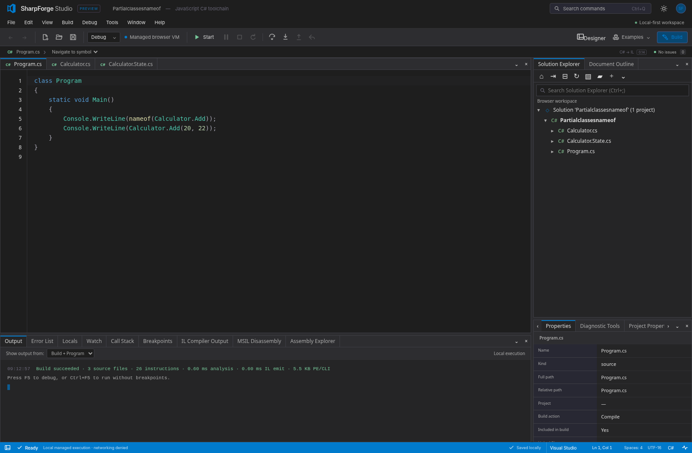
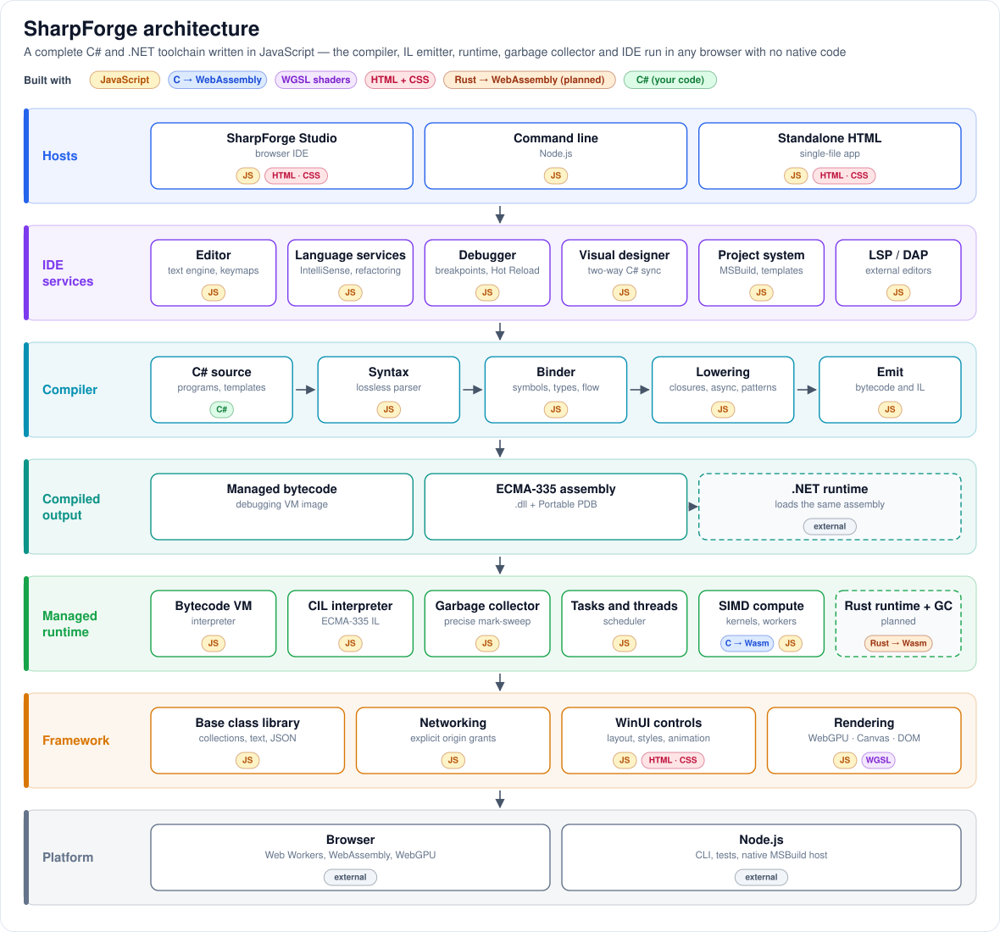
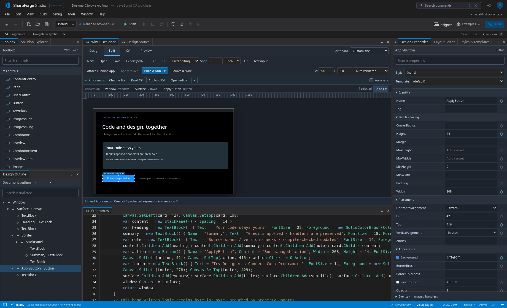
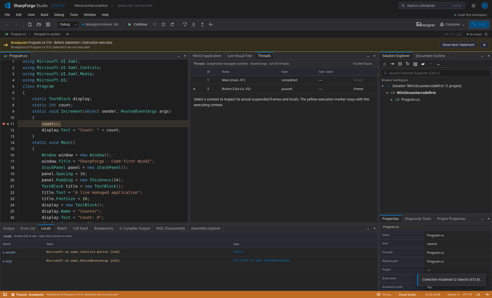
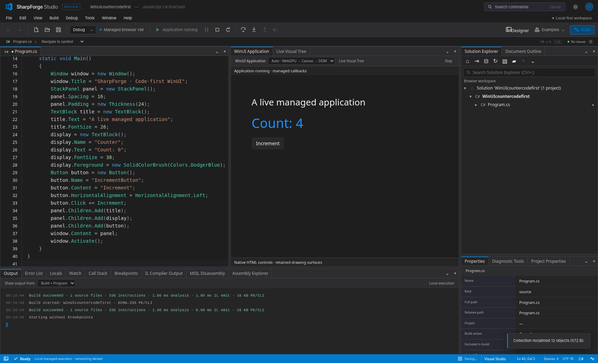
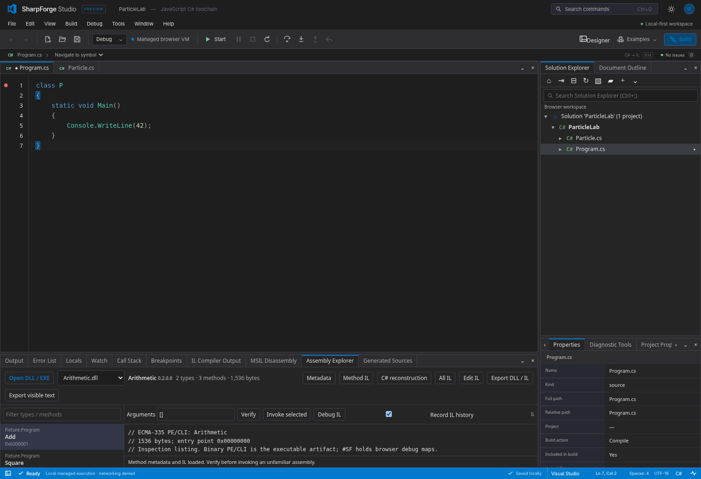

<h1 align="center">SharpForge</h1>

<p align="center">
  <strong>A complete C# toolchain that runs in the browser.</strong><br>
  Compiler, .NET-compatible IL, managed runtime, debugger, WinUI-style UI framework, visual designer and a Visual Studio-style IDE — written in JavaScript, with no server and no install.
</p>

<p align="center">
  <a href="https://wieslawsoltes.github.io/SharpForge/"><strong>Open SharpForge Studio →</strong></a>
  &nbsp;·&nbsp;
  <a href="#quick-start">Quick start</a>
  &nbsp;·&nbsp;
  <a href="#architecture">Architecture</a>
  &nbsp;·&nbsp;
  <a href="#status">Status</a>
  &nbsp;·&nbsp;
  <a href="https://github.com/wieslawsoltes/SharpForge/issues/1">Roadmap</a>
</p>

<p align="center">
  
  
  
  <a href="https://github.com/wieslawsoltes/SharpForge/actions/workflows/ci.yml"></a>
</p>



> **Work in progress.** SharpForge is a development preview on the way to full C#, CLR, .NET BCL, WinUI and Visual Studio parity. Features below are marked **Available**, **Preview**, **WIP** or **Planned**. A program compiling and running here is not yet a guarantee that it behaves exactly as it does on .NET; see [Status](#status).

## What is SharpForge?

SharpForge lets you write, build, run, debug and design C# applications entirely inside a web page.

- **Write** C# in an editor with IntelliSense, navigation, refactorings and Visual Studio, VS Code, Vim, Emacs or Sublime key bindings.
- **Build** it with a C# compiler that emits real ECMA-335 assemblies (`.dll`) and Portable PDBs that the .NET runtime also loads.
- **Run** it on a managed runtime with its own garbage collector, task scheduler and base class library — in a Web Worker, in Node.js, or from the command line.
- **Debug** it with breakpoints, stepping, watches, call stacks, reverse stepping, IL-level debugging and Hot Reload.
- **Design** user interfaces with WinUI-shaped controls and a visual designer that edits your C# in both directions.
- **Ship** nothing to a server: the whole product is a static site, and it also works as a single offline HTML file.

## Features

### Language and compiler

| Feature | Status |
|---|---|
| Lossless, incremental C# parser (trivia-preserving, error-recovering) covering C# 1–14 syntax, checked against Roslyn syntax trees | **Available** |
| Language-version gating (`LangVersion` 1–14, `preview`) with Roslyn diagnostic ids and spans | **Available** |
| Semantic model: symbols, namespaces, overload and conversion resolution, flow analysis, nullable analysis | **Preview** |
| Classes, properties, methods, arrays, exceptions, `using`, checked arithmetic, async/await, collection expressions | **Available** |
| Delegates, lambdas, closures, local functions, events, iterators, async/await, query expressions, tuples, records, patterns | **Preview** |
| Generics, inheritance and interfaces, structs, `Nullable<T>`, full numeric types, `ref` locals and returns, expression trees | **Preview** — compiled to real .NET assemblies that run on .NET; execution in the built-in runtime is **WIP** |
| Direct .NET assembly output (`compileToAssembly`): real IL method bodies and metadata, verified by running the output on .NET | **Preview** |
| Binding against real .NET reference assemblies (LINQ, spans, the full BCL surface) | **Preview** |
| C# 15 preview features (closed hierarchies, extension indexers, memory-safety rules; unions not yet) | **WIP** — follows the published proposals; no reference compiler exists yet |
| ECMA-335 PE/CLI emit, Portable PDB, IL assembler, disassembler and decompiler | **Preview** |
| Roslyn-compatible analyzers and source generators | **Planned** (trusted JavaScript analyzers and generators are **Available**) |

### Runtime

| Feature | Status |
|---|---|
| Managed bytecode VM and direct CIL interpreter | **Available** |
| Precise mark-and-sweep garbage collector | **Available** |
| Generational, incremental and compacting collection; finalizers; weak handles | **Planned** |
| Tasks, async scheduling, cooperative threads | **Available** |
| Shared-memory managed threads, synchronization primitives, `Parallel` | **Planned** |
| WebAssembly SIMD numeric kernels and compute workers | **Preview** |
| `System.Numerics`, hardware intrinsics, full `Math`/`MathF` | **WIP** |
| Base class library: strings, collections, JSON, `Random`, `HttpClient`, WebSocket | **Preview** — a growing subset of .NET |
| Full .NET BCL (LINQ, `Span<T>`, IO, globalization, regex, crypto, …) | **Planned** |
| Loading and executing arbitrary third-party .NET assemblies, reflection | **WIP** |
| Rust runtime and garbage collector compiled to WebAssembly | **Planned** |

### UI framework and designer

| Feature | Status |
|---|---|
| Code-first WinUI-shaped controls, layout panels, styles, templates and animations | **Preview** |
| DOM, Canvas 2D and WebGPU rendering back ends | **Preview** — WebGPU draws basic shapes today |
| Full WebGPU drawing behind the WinUI API; composition | **WIP** |
| Data binding, resources and themes, `VisualStateManager`, XAML loading | **Planned** |
| Visual designer with toolbox, property grid, visual tree and two-way C# sync | **Preview** |
| Designer as a Design / Split / Code view on any C# document | **WIP** |

### IDE (SharpForge Studio)

| Feature | Status |
|---|---|
| Docking workbench with 44 tool windows, split editors, floating windows, saved layouts | **Available** |
| Solution Explorer, project and item templates, `.csproj` / `.slnx` / `.sln`, ZIP and folder workspaces | **Available** |
| IntelliSense, go to definition, find references, rename, code actions, formatting | **Preview** |
| Debugger: breakpoints, stepping, watches, call stack, reverse stepping, IL debugging, Hot Reload | **Preview** |
| Assembly Explorer: open, inspect, decompile, edit IL and run a `.dll` | **Preview** |
| Native MSBuild and .NET SDK builds through a local trusted host | **Preview** |
| Running several applications at once | **WIP** |
| Publish any project as a standalone HTML application | **WIP** |
| Git: open and work on remote repositories with a token or web sign-in | **Planned** |
| NuGet package management, Test Explorer | **Planned** |
| LSP and DAP servers for external editors | **Preview** |

## Architecture

SharpForge is a set of small, independent packages composed into three hosts: the Studio IDE, a command-line tool, and standalone HTML output.



**What makes it unusual: the whole .NET-style stack is written in JavaScript.** There is no C++ runtime, no Roslyn and no server behind it.

| Part | Written in | Notes |
|---|---|---|
| C# compiler (parser, binder, lowering, emit) | JavaScript | A from-scratch C# front end, not a port of Roslyn |
| ECMA-335 assembly and Portable PDB writer, reader, IL assembler, decompiler | JavaScript | Produces real `.dll` files that the .NET runtime loads |
| Managed runtime: bytecode VM, CIL interpreter, garbage collector, task scheduler | JavaScript | Runs in a Web Worker or Node.js |
| Base class library, networking | JavaScript | Implemented over browser and Node.js APIs |
| WinUI controls, layout, styles, animation | JavaScript, with HTML and CSS | WinUI-shaped API over the web platform |
| Rendering | JavaScript, with WGSL shaders | WebGPU, with Canvas 2D and DOM fallbacks |
| SIMD numeric kernels | C compiled to WebAssembly | Called from the JavaScript runtime; scalar JavaScript fallback |
| IDE: editor, docking, debugger UI, designer, project system, LSP/DAP | JavaScript, with HTML and CSS | No UI framework; a vendored CodeMirror engine backs the Vim, Emacs and Sublime editing modes |
| Rust runtime and garbage collector | Rust compiled to WebAssembly | **Planned** — a second, faster execution engine |
| Programs, templates and examples | C# | What you write |

The product has no npm runtime dependencies. Python is used only for the browser test suites. Dashed boxes in the diagram are planned (Rust runtime) or external (.NET runtime, shown because it loads the same assemblies SharpForge emits).

**How a program flows through it.** Source text is parsed into a lossless syntax tree, bound into a typed semantic model, lowered (closures, iterators, async and patterns become plain classes and control flow) and emitted twice: as compact managed bytecode for the debugging VM, and as a standard ECMA-335 assembly that the CIL interpreter — or a real .NET runtime — can load. The runtime executes it inside a Web Worker with its own heap, garbage collector and scheduler; framework calls reach the base class library, the network layer (denied unless an origin is explicitly granted) and the WinUI layer, which renders through WebGPU, Canvas or the DOM.

### Packages

| Layer | Packages |
|---|---|
| Text and syntax | `text`, `syntax` |
| Compiler | `compiler`, `symbols`, `extensions` |
| Binary formats | `bytecode`, `cil` |
| Runtime | `runtime`, `compute`, `network` |
| Framework and UI | `framework`, `winui`, `designer` |
| Language tooling | `language`, `refactoring`, `debugger`, `protocol` |
| Projects and workspace | `project-system`, `msbuild`, `templates`, `archive`, `workspace` |
| IDE building blocks | `editor`, `docking`, `controls` |
| Applications | `apps/studio`, `apps/cli` |

Every package under `packages/` is published as `@sharpforge/<name>` and can be used on its own; see [Embedding](docs/embedding.md). Design details are in [Architecture](docs/architecture.md).

## Quick start

**In the browser** — open <https://wieslawsoltes.github.io/SharpForge/>. Pick an example from **Examples**, press **Start**, set a breakpoint, or open **Designer**.

**Locally** — requires Node.js 22 or later; there are no runtime dependencies.

```bash
git clone https://github.com/wieslawsoltes/SharpForge.git
cd SharpForge
npm ci
npm start          # builds and serves Studio at http://127.0.0.1:4173
```

**From the command line**

```bash
node apps/cli/main.js run Program.cs                 # compile and run
node apps/cli/main.js compile Program.cs -o app.dll  # emit a .NET assembly
node apps/cli/main.js exec app.dll                   # run an assembly
node apps/cli/main.js compile Program.cs --format dotnet -o app.dll && dotnet app.dll
                                                     # a real .NET assembly, bound against the installed
                                                     # SDK's reference pack, run by the .NET runtime
node apps/cli/main.js decompile library.dll          # inspect any assembly
node apps/cli/main.js new console --name Hello -o ./Hello
node apps/cli/main.js --help
```

**A first program**

```csharp
using System;

var total = 0;
foreach (var n in new[] { 1, 2, 3, 4 })
    total += n * n;

Console.WriteLine($"Sum of squares: {total}");
```

**A first window**

```csharp
using Microsoft.UI.Xaml;
using Microsoft.UI.Xaml.Controls;

class Program
{
    static TextBlock label;
    static int count;

    static void OnClick(object sender, RoutedEventArgs args)
    {
        count++;
        label.Text = $"Clicked {count} times";
    }

    static void Main()
    {
        label = new TextBlock { Text = "Clicked 0 times" };
        var button = new Button { Content = "Click me" };
        button.Click += OnClick;

        var panel = new StackPanel { Spacing = 12 };
        panel.Children.Add(label);
        panel.Children.Add(button);

        var window = new Window { Title = "Hello SharpForge", Content = panel };
        window.Activate();
    }
}
```

## Screenshots

| Designer with two-way C# sync | Debugger |
|---|---|
|  |  |

| WinUI application | Assembly Explorer |
|---|---|
|  |  |

## Status

SharpForge 0.14 is a **development preview**. It implements a documented, growing subset of C#, the CLR, the .NET base class library and WinUI. The goal is full parity; the work is tracked in the open.

| Area | Today | Target | Board |
|---|---|---|---|
| C# compiler | C# 1–14 syntax; Roslyn-matched diagnostics on most of a 1,350-program corpus; direct .NET assembly output whose results match .NET on 481 of 498 corpus programs | C# 1–14 and 15 preview, Roslyn-equivalent | [C# Compiler](https://github.com/users/wieslawsoltes/projects/5) |
| CLR, IL and symbols | Emit and read ECMA-335; executes its own output and a subset of ordinary assemblies | Full ECMA-335 loading, verification, reflection | [CLR, IL & Symbols](https://github.com/users/wieslawsoltes/projects/6) |
| Runtime | Two interpreters, cooperative scheduler | Full CLR execution semantics, tiered execution | [JS Runtime](https://github.com/users/wieslawsoltes/projects/7) |
| Garbage collector | Precise mark-and-sweep | Generational, incremental, compacting | [Garbage Collector](https://github.com/users/wieslawsoltes/projects/8) |
| Base class library | Core subset | .NET BCL | [BCL](https://github.com/users/wieslawsoltes/projects/9) |
| SIMD and numerics | Wasm SIMD kernels, core `Math` | `System.Numerics`, intrinsics, generic math | [SIMD & Numerics](https://github.com/users/wieslawsoltes/projects/10) |
| Threading | Tasks and cooperative threads | Shared-memory threads, full TPL | [Threading](https://github.com/users/wieslawsoltes/projects/11) |
| Networking | `HttpClient` and WebSocket subset with origin grants | Full client stack | [Networking](https://github.com/users/wieslawsoltes/projects/12) |
| Debugger | Source and IL debugging, reverse stepping, Hot Reload subset | Visual Studio-class debugging | [Debugger](https://github.com/users/wieslawsoltes/projects/13) |
| WinUI and rendering | About 60 controls, DOM-first rendering | WinUI 3 parity, WebGPU drawing | [WinUI & WebGPU](https://github.com/users/wieslawsoltes/projects/14) |
| Designer | Tool-window designer with C# sync | Per-document Design / Split / Code | [Designer](https://github.com/users/wieslawsoltes/projects/15) |
| IDE | Docking workbench, editor, explorer | Visual Studio parity, many running apps | [IDE](https://github.com/users/wieslawsoltes/projects/16) |
| Language services | Completion, navigation, rename, a set of refactorings | Roslyn-class services, analyzers, generators | [Language Services](https://github.com/users/wieslawsoltes/projects/17) |
| Projects and build | `.csproj` / `.slnx` subset, native MSBuild bridge | Full MSBuild evaluation, NuGet, tests | [Projects & Build](https://github.com/users/wieslawsoltes/projects/18) |
| Git | — | Remote repositories, token and web sign-in | [Git](https://github.com/users/wieslawsoltes/projects/19) |
| Publishing | Studio as one HTML file | Any app as a standalone HTML file | [Standalone HTML](https://github.com/users/wieslawsoltes/projects/20) |
| Rust runtime | — | Rust runtime and GC for native and WebAssembly | [Rust Runtime & GC](https://github.com/users/wieslawsoltes/projects/21) |

The full programme, with every epic and task, is on the [Portfolio board](https://github.com/users/wieslawsoltes/projects/3) and in the [tracking issue](https://github.com/wieslawsoltes/SharpForge/issues/1).

**Known limits today.** Not every valid C# program compiles or runs; programs using features the runtime cannot execute yet are rejected with a clear diagnostic rather than miscompiled. The base class library is a subset and can differ from .NET in formatting and culture behaviour. The WinUI layer follows WinUI's API shape but is not the Windows App SDK. See [Compatibility](docs/compatibility.md).

## Security model

- Everything runs locally in your browser; your code is not uploaded.
- Managed programs cannot reach the network unless you grant an exact origin, and grants are never restored from saved workspaces.
- The site ships with a strict Content-Security-Policy and uses no `eval`.
- Native builds run only through an explicitly trusted local host.

## Documentation

| Topic | Document |
|---|---|
| Architecture | [docs/architecture.md](docs/architecture.md) |
| Language, runtime and networking | [docs/language-runtime-networking.md](docs/language-runtime-networking.md) |
| Compatibility and limits | [docs/compatibility.md](docs/compatibility.md) |
| Managed IL and the CIL interpreter | [docs/managed-il.md](docs/managed-il.md) |
| Debugger | [docs/debugger.md](docs/debugger.md) |
| WinUI and the designer | [docs/csharp-designer-winui.md](docs/csharp-designer-winui.md) |
| Docking workbench | [docs/docking.md](docs/docking.md) |
| Project system | [docs/project-system.md](docs/project-system.md) |
| Native MSBuild | [docs/msbuild.md](docs/msbuild.md) |
| LSP and DAP servers | [docs/protocols.md](docs/protocols.md) |
| Embedding the packages | [docs/embedding.md](docs/embedding.md) |
| Release notes | [CHANGELOG.md](CHANGELOG.md), [docs/release-0.14.0.md](docs/release-0.14.0.md) |

## Development

```bash
npm run check            # syntax check
npm run check:structure  # file-size and structure gate
npm test                 # unit and integration tests
npm run build            # build Studio into dist/
npm run standalone       # build the single-file SharpForge-standalone.html
```

Browser tests use Playwright (`pip install -r tests/requirements.txt`, then `npm run test:browser`).

## Contributing

Contributions are welcome. Read [CONTRIBUTING.md](CONTRIBUTING.md) first — it covers architecture rules, code quality, file-size limits, performance expectations, testing and the pull-request workflow. Work items live on the [project boards](https://github.com/wieslawsoltes/SharpForge/issues/1); pick one marked *Ready*.

## License

[MIT](LICENSE). Third-party notices are in [THIRD_PARTY_NOTICES.md](THIRD_PARTY_NOTICES.md).

SharpForge is an independent project. It is not affiliated with or endorsed by Microsoft; C#, .NET, Visual Studio, WinUI and Windows are trademarks of Microsoft Corporation.
